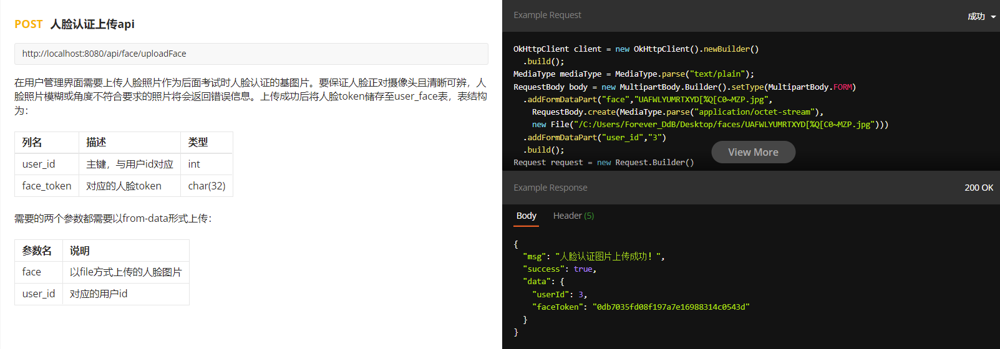
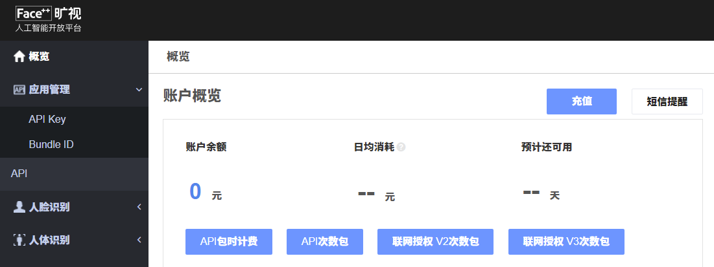
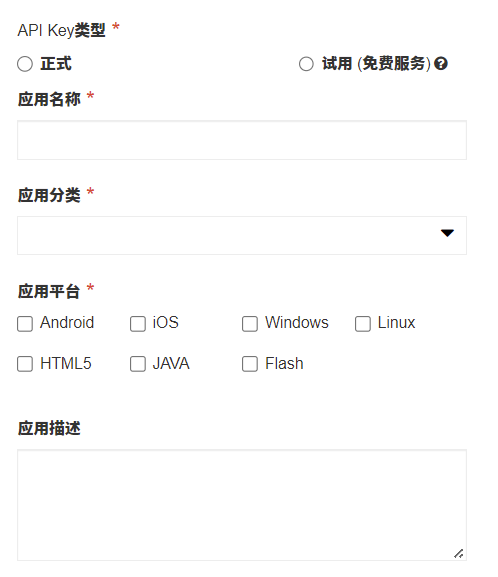
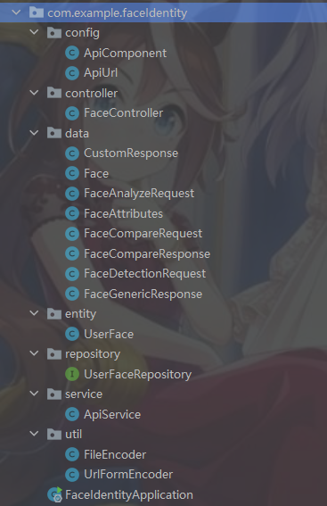

**由于服创项目的教考平台需要一个考试过程学生人脸认证的功能，因此使用springboot调用现成的API实现后端接口。**

# 最终结果示例

先看看最终结果：

请求对应 api ，得到人脸分析的结果：




# 项目准备

## 注册Api

使用了Face++的人脸识别接口： https://www.faceplusplus.com.cn/

使用本接口首先在官网上注册账号，完成后进入控制台：



在**应用管理 - API Key** 里，选择**创建 API Key** ：



创建成功后复制得到对应的 **API Key** 和 **API Secret** 。

这就是后面调用 api 时需要用到的参数。

## 创建Springboot项目

本项目的 Maven 依赖如下：

```xml
        <dependency>
            <groupId>org.springframework.boot</groupId>
            <artifactId>spring-boot-starter-web</artifactId>
        </dependency>
        <dependency>
            <groupId>org.springframework.boot</groupId>
            <artifactId>spring-boot-devtools</artifactId>
            <scope>runtime</scope>
            <optional>true</optional>
        </dependency>

		<!-- 数据库相关 -->
		<dependency>
            <groupId>org.springframework.boot</groupId>
            <artifactId>spring-boot-starter-data-jpa</artifactId>
        </dependency>
        <dependency>
            <groupId>mysql</groupId>
            <artifactId>mysql-connector-java</artifactId>
            <scope>runtime</scope>
        </dependency>
		
		<!-- 一些工具包 -->
        <dependency>
            <groupId>org.springframework.boot</groupId>
            <artifactId>spring-boot-configuration-processor</artifactId>
            <optional>true</optional>
        </dependency>
        <dependency>
            <groupId>org.projectlombok</groupId>
            <artifactId>lombok</artifactId>
            <optional>true</optional>
        </dependency>
		<dependency>
            <groupId>com.alibaba</groupId>
            <artifactId>fastjson</artifactId>
            <version>1.2.79</version>
        </dependency>
        <dependency>
            <groupId>com.squareup.okhttp3</groupId>
            <artifactId>okhttp</artifactId>
            <version>3.3.0</version>
        </dependency>
```

使用了 fastjson 来帮助处理 Json 格式数据，用 okHttp 来进行 api 请求。

项目编写的包结构如下：



建立的数据库表user_face为：

```mysql
create table user_face
(
   user_id int not null,
   face_token char(32) null,
   constraint user_faces_pk
      primary key (user_id)
);
```

# 配置类和工具类

## Api 配置类

### com.example.faceIdentity.config.ApiComponent

这个类用于每次请求 api 的时候带上这个类的参数来认证 api：

```java
@Data
@Component
@ConfigurationProperties(prefix = "com.example.face-identity.api-component")
public class ApiComponent {
    private String api_key;
    private String api_secret;
}
```

### com.example.faceIdentity.config.ApiUrl

这个类用于配置不同 api 请求的地址：

```java
@Data
@Component
@ConfigurationProperties(prefix = "com.example.face-identity.api-url")
public class ApiUrl {
    //人脸检测api
    private String detect_url;
    //人脸分析api
    private String analyze_url;
    //人脸对比api
    private String compare_url;
}
```

### 在application.yml中配置

对以上编写的属性进行配置：

```yaml
com.example.faceIdentity:
  ApiComponent:
    api-key: 填入自己的 api key
    api-secret: 填入自己的 api secret
  ApiUrl:
    detect-url: https://api-cn.faceplusplus.com/facepp/v3/detect
    analyze-url: https://api-cn.faceplusplus.com/facepp/v3/face/analyze
    compare-url: https://api-cn.faceplusplus.com/facepp/v3/compare
```

由于调用的 api 有上传文件大小的限制，我们在此直接将其限制在调用 api 前：

```yaml
spring:
  servlet:
    multipart:
      enabled: true
      file-size-threshold: 0
      max-file-size: 2MB
      max-request-size: 20MB
```


## 数据库配置类

### com.example.faceIdentity.entity.UserFace

这个类是数据库表user_face的映射，与表结构相同：

```java
@Data
@Entity
@Table(name = "user_face")
public class UserFace {
    @Id
    private Long userId;
    private String faceToken;
}
```

### com.example.faceIdentity.repository.UserFaceRepository

用了 Spring-data-jpa 后只需声明一个继承自 CrudRepository 接口的接口，会自动根据方法名生成对应的实现方法：

```java
public interface UserFaceRepository extends CrudRepository<UserFace, Long> {
    UserFace findByUserId(Long id);//只需要一个通过id查询face的方法
}
```

后面使用时直接在 controller 里注入：

```java
@Autowired
private UserFaceRepository repository;
```

同时还会自动生成很多数据库基础方法，如 save(UserFace),  findAll() 等。

### 在application.yml中配置

这里是配置一些 springboot 连接数据库的内容，这样 jpa 可以在运行时自动生成相应的 jdbc 连接。

```yml
spring:
  datasource:
    url: jdbc:mysql://127.0.0.1:3306/test?characterEncoding=UTF-8
    username: root
    password: xxx
    driver-class-name: com.mysql.cj.jdbc.Driver
```


## 基础工具类

因为有些处理文件和 Http 请求的需求，但是懒得导一堆包了，直接写俩工具类。

### com.example.faceIdentity.util.FileEncoder

这个类用来把上传的图片转 **base64**

```java
public class FileEncoder {
    public static String multipartFileToBase64(MultipartFile file){
        try {
            //将文件存入byte数组
            InputStream inputStream = file.getInputStream();
            BufferedInputStream bufferedInputStream = new BufferedInputStream(inputStream);
            int len = bufferedInputStream.available();
            byte[] fileData = new byte[len];
            if((bufferedInputStream.read(fileData)) == -1){
                throw new IOException();
            }
            //文件转base64
            BASE64Encoder encoder = new BASE64Encoder();
            String base64Str = encoder.encode(fileData);

            return base64Str;
        }catch (IOException e){
            e.printStackTrace();
        }
        return null;
    }
}
```

### com.example.faceIdentity.util.UrlFormEncoder

这个类用于在 url 后面加上需要的参数：

```java
public class UrlFormEncoder {
    public static String encodeWithParams(String url, JSONObject params){
        StringBuffer stringBuffer = new StringBuffer(url);
        if(!params.isEmpty()){
            stringBuffer.append("?");
        }
        for(String key: params.keySet()){
            stringBuffer.append(key + "=" + params.getString(key));
            stringBuffer.append("&");
        }
        return stringBuffer.toString();
    }
}
```

# 主体数据结构

**调用 api 最重要的就是要熟悉 api 的请求和响应结构，并且严格按照其规范来编写对应的映射类。**

由于项目主要用到的 api 是这三个：


研究其文档发现其响应格式有一个通用结构，其类映射如下：

## 响应数据格式

### com.example.faceIdentity.data.FaceGenericResponse

```java
/**
 * @author ForeverDdB 835236331@qq.com
 * @ClassName FaceDetection
 * @Description 通用人脸识别api返回数据格式
 * @createTime 2022年 02月21日 18:02
 **/
@Data
@NoArgsConstructor(force = true)
public class FaceGenericResponse {
    private String request_id;
    private int time_used;
    private ArrayList<Face> faces;//一个储存了多个人脸数据的数组
    private int face_num;//检测到的人脸数量
}
```

对于每个检测出的人脸，我们也编写一个相应的映射：

### com.example.faceIdentity.data.Face

```java
/**
 * @author ForeverDdB 835236331@qq.com
 * @ClassName Face
 * @Description 人脸数据模型
 * @createTime 2022年 02月22日 21:51
 **/
@Data
@NoArgsConstructor(force = true)
public class Face {
    private String face_token;//返回对应的人脸token
    private HashMap<String, Integer> face_rectangle;//人脸在图片中所处位置矩阵
    private FaceAttributes attributes;//人脸相关参数
}
```

### com.example.faceIdentity.data.FaceAttributes

下列每个属性的注释均来自于 api 官方文档：

```java
@Data
@NoArgsConstructor(force = true)
public class FaceAttributes {
    //性别分析结果。返回值为：
    //Male	男性
    //Female	女性
    private String gender;

    //年龄分析结果。返回值为一个非负整数。
    private int age;

    //笑容分析结果。返回值包含以下属性：
    //value：值为一个 [0,100] 的浮点数，小数点后3位有效数字。数值越大表示笑程度高。
    //threshold：代表笑容的阈值，超过该阈值认为有笑容。
    private HashMap<String, Float> smile;

    //人脸姿势分析结果。返回值包含以下属性，每个属性的值为一个 [-180, 180] 的浮点数，小数点后 6 位有效数字。单位为角度。
    //pitch_angle：抬头
    //roll_angle：旋转（平面旋转）
    //yaw_angle：摇头
    private HashMap<String, Float> headpose;

    //人脸模糊分析结果。返回值包含以下属性：
    //blurness：新的人脸模糊分析结果。
    //每个属性都包含以下字段：
    //value 的值为是一个浮点数，范围 [0,100]，小数点后 3 位有效数字。
    //threshold 表示人脸模糊度是否影响辨识的阈值。
    private HashMap<String, HashMap<String, Float>> blur;

    //眼睛状态信息。返回值包含以下属性：
    //left_eye_status：左眼的状态
    //right_eye_status：右眼的状态
    //每个属性都包含以下字段。每个字段的值都是一个浮点数，范围 [0,100]，小数点后 3 位有效数字。字段值的总和等于 100。
    //occlusion：眼睛被遮挡的置信度
    //no_glass_eye_open：不戴眼镜且睁眼的置信度
    //normal_glass_eye_close：佩戴普通眼镜且闭眼的置信度
    //normal_glass_eye_open：佩戴普通眼镜且睁眼的置信度
    //dark_glasses：佩戴墨镜的置信度
    //no_glass_eye_close：不戴眼镜且闭眼的置信度
    private HashMap<String, HashMap<String, Float>> eyestatus;

    //情绪识别结果。返回值包含以下字段。每个字段的值都是一个浮点数，范围 [0,100]，小数点后 3 位有效数字。每个字段的返回值越大，则该字段代表的状态的置信度越高。字段值的总和等于 100。
    //anger：愤怒
    //disgust：厌恶
    //fear：恐惧
    //happiness：高兴
    //neutral：平静
    //sadness：伤心
    //surprise：惊讶
    private HashMap<String, Float> emotion;

    //人脸质量判断结果。返回值包含以下属性：
    //value：值为人脸的质量判断的分数，是一个浮点数，范围 [0,100]，小数点后 3 位有效数字。
    //threshold：表示人脸质量基本合格的一个阈值，超过该阈值的人脸适合用于人脸比对。
    private HashMap<String, Float> facequality;

    //颜值识别结果。返回值包含以下两个字段。每个字段的值是一个浮点数，范围 [0,100]，小数点后 3 位有效数字。
    //male_score：男性认为的此人脸颜值分数。值越大，颜值越高。
    //female_score：女性认为的此人脸颜值分数。值越大，颜值越高。
    private HashMap<String, Float> beauty;

    //嘴部状态信息，包括以下字段。每个字段的值都是一个浮点数，范围 [0,100]，小数点后 3 位有效数字。字段值的总和等于 100。
    //surgical_mask_or_respirator：嘴部被医用口罩或呼吸面罩遮挡的置信度
    //other_occlusion：嘴部被其他物体遮挡的置信度
    //close：嘴部没有遮挡且闭上的置信度
    //open：嘴部没有遮挡且张开的置信度
    private HashMap<String, Float> mouthstatus;

    //眼球位置与视线方向信息。返回值包括以下属性：
    //left_eye_gaze：左眼的位置与视线状态
    //right_eye_gaze：右眼的位置与视线状态
    //每个属性都包括以下字段，每个字段的值都是一个浮点数，小数点后 3 位有效数字。
    //position_x_coordinate: 眼球中心位置的 X 轴坐标。
    //position_y_coordinate: 眼球中心位置的 Y 轴坐标。
    //vector_x_component: 眼球视线方向向量的 X 轴分量。
    //vector_y_component: 眼球视线方向向量的 Y 轴分量。
    //vector_z_component: 眼球视线方向向量的 Z 轴分量。
    private HashMap<String, HashMap<String, Float>> eyegaze;

    //面部特征识别结果，包括以下字段。每个字段的值都是一个浮点数，范围 [0,100]，小数点后 3 位有效数字。每个字段的返回值越大，则该字段代表的状态的置信度越高。
    //health：健康
    //stain：色斑
    //acne：青春痘
    //dark_circle：黑眼圈
    private HashMap<String, Float> skinstatus;
}
```

### com.example.faceIdentity.data.FaceCompareResponse

人脸对比 api 的结果稍有不同，我在此还加入了几个验证结果有效性的方法。

```java
@Data
@NoArgsConstructor(force = true)
public class FaceCompareResponse {
    private Float confidence;//人脸对比的结果
    private HashMap<String, Float> thresholds;//一组阈值，对比结果超过此阈值即可认为是同一个人
    /**
     * 校验是否进行了有效的人脸对比
     * @method isValid
     * @return boolean
     *
     */
    public boolean isValid(){
        if(confidence > 0.0){
            return true;
        }
        return false;
    }
    /**
     * 校验是否匹配人脸
     * @method isMatched
     * @return boolean
     *
     */
    public boolean isMatched(){
        //这里用万分之一阈值
        if(thresholds.get("1e-4") <= confidence){
            return true;
        }
        return false;
    }
}
```

## 请求数据格式

由于不同 api 所需的请求格式不尽相同，因此针对每个 api 写一个对应的请求类。

### com.example.faceIdentity.data.FaceDetectionRequest

人脸检测 api 只需要一个人脸图片参数，在此以 base64 形式上传：

```java
/**
 * @author ForeverDdB 835236331@qq.com
 * @ClassName FaceDetectionRequest
 * @Description 人脸检测api发送请求格式
 * @createTime 2022年 02月21日 18:53
 **/
@RequiredArgsConstructor
@Data
public class FaceDetectionRequest {
    private final String image_base64;
}
```

### com.example.faceIdentity.data.FaceAnalyzeRequest

人脸分析是采用人脸检测结果得到的人脸 token 作为人脸参数，同时还需带上需要分析的属性参数。

由于项目需求只采用 facequality 参数，分析可得到此人脸是否适合作为后续人脸对比的基础图片阈值。

```java
/**
 * @author ForeverDdB 835236331@qq.com
 * @ClassName FaceAnalyzeRequest
 * @Description 人脸分析api发送请求格式
 * @createTime 2022年 02月22日 21:27
 **/
@Data
@RequiredArgsConstructor
public class FaceAnalyzeRequest {
    private final String face_tokens;
    private String return_attributes = "headpose,facequality";
}
```

### com.example.faceIdentity.data.FaceGenericResponse

人脸对比只需传入两张需要对比的人脸，在项目中其中一张人脸来自于数据库中储存的对应用户人脸。

```java
/**
 * @author ForeverDdB 835236331@qq.com
 * @ClassName FaceCompareRequest
 * @Description 人脸对比api返回结果
 * @createTime 2022年 02月26日 22:41
 **/
@Data
@RequiredArgsConstructor
public class FaceCompareRequest {
    private final String face_token1;
    private final String face_token2;
}
```

# 编写程序主体

## 控制器

需要开发的 api 不多，因此用一个控制器即可完成功能。

此控制器中需要用编写的 Service 来进行人脸 api 方面的处理，相关描述在控制器后面部分。

### com.example.faceIdentity.controller.FaceController

```java
@Slf4j
@RestController
@RequestMapping("/api/face")
@MultipartConfig
public class FaceController {
    @Autowired
    private ApiService apiService;
    @Autowired
    private UserFaceRepository repository;

    /**
     * 上传人脸图片并调用api处理请求
     *
     * @param file: 人脸图片
     * @return java.lang.String
     * @method faceCheck
     */
    public CustomResponse<FaceGenericResponse> faceDetect(MultipartFile file) throws IOException {
        //图片转base64
        String base64Str = FileEncoder.multipartFileToBase64(file);
        //检测人脸
        FaceDetectionRequest faceDetectRequest = new FaceDetectionRequest(base64Str);
        FaceGenericResponse faceDetectResponse = apiService.processFace(faceDetectRequest, ApiService.ApiType.DETECT, FaceGenericResponse.class);
        //分析人脸
        CustomResponse<FaceGenericResponse> response = apiService.processFaceAttr(faceDetectResponse, ApiService.AttrType.BASIC);

        return response;
    }

    /**
     * 上传人脸认证图片并保存到数据库
     * @param file: 人脸图片
     * @param userId: 对应人脸的用户id
     * @method faceSave
     * @return com.example.faceIdentity.data.CustomResponse<com.example.faceIdentity.entity.UserFace>
     *
     */
    @PostMapping("/uploadFace")
    public CustomResponse<UserFace> faceSave(@RequestParam("face") MultipartFile file, @RequestParam("user_id") Long userId){
        CustomResponse<UserFace> response = new CustomResponse<>();
        response.setSuccess(false);
        response.setData(null);
        try {
            //检测人脸
            CustomResponse<FaceGenericResponse> faceDetectResponse = faceDetect(file);
            if (faceDetectResponse.getMsg().contains("成功")){
                //获取对应人脸token
                UserFace userFace = new UserFace();
                userFace.setUserId(userId);
                userFace.setFaceToken(faceDetectResponse.getData().getFaces().get(0).getFace_token());
                //将人脸存入对应用户数据库
                repository.save(userFace);
                //返回响应
                response.setMsg("人脸认证图片上传成功！");
                response.setSuccess(true);
                response.setData(userFace);
            }else {
                response.setMsg(faceDetectResponse.getMsg());
            }
        }catch (IOException e){
            e.printStackTrace();
            response.setMsg("人脸数据检测失败");
        }

        return response;
    }

    /**
     * 上传人脸图片并返回与相应用户对比的结果
     *
     * @param file:   人脸图片
     * @param userId: 需要对比的用户id
     * @return com.example.faceIdentity.data.CustomResponse<com.example.faceIdentity.data.FaceCompareResponse>
     * @method faceCompare
     */
    @PostMapping("/compare")
    public CustomResponse<FaceCompareResponse> faceCompare(@RequestParam("face") MultipartFile file, @RequestParam("user_id") Long userId) throws IOException {
        //图片转base64
        String base64Str = FileEncoder.multipartFileToBase64(file);
        //获取用户对应人脸token
        UserFace userFace = repository.findByUserId(userId);
        String face_token2 = userFace.getFaceToken();
        //获取人脸
        FaceDetectionRequest faceDetectRequest = new FaceDetectionRequest(base64Str);
        FaceGenericResponse faceDetectResponse = apiService.processFace(faceDetectRequest, ApiService.ApiType.DETECT, FaceGenericResponse.class);
        ArrayList<Face> faces = faceDetectResponse.getFaces();

        CustomResponse<FaceCompareResponse> response = new CustomResponse<>();
        response.setMsg("人脸不匹配");
        response.setSuccess(false);
        response.setData(null);
        if (faces.isEmpty()){
            response.setMsg("未检测到有效人脸");
            return response;
        }
        //对比图片中每一个人脸
        for (Face face : faces) {
            String face_token1 = face.getFace_token();

            FaceCompareRequest faceCompareRequest = new FaceCompareRequest(face_token1, face_token2);
            FaceCompareResponse faceCompareResponse = apiService.processFace(faceCompareRequest, ApiService.ApiType.COMPARE, FaceCompareResponse.class);
            log.info(faceCompareResponse.toString());

            if (faceCompareResponse.isValid() && faceCompareResponse.isMatched()) {
                response.setMsg("人脸匹配成功");
                response.setSuccess(true);
                response.setData(faceCompareResponse);
            }
        }

        return response;
    }
}
```

### com.example.faceIdentity.data.CustomResponse

该控制器中用到了自定义的一个泛型类，用于向用户返回一个通用的响应体：

```java
@Data
@NoArgsConstructor(force = true)
public class CustomResponse<T> {
    private String msg;
    private boolean success;
    private T data;
}
```

## Service

这是用于处理控制器中需要用到的人脸 api 处理请求，编写了几个通用的服务。

主体使用了 okhttp 来进行 http 请求以调用 api，同时其方法对 api 结果进行了处理，最后只返回通用的简单响应体结构。

使用 @Service 注解来使其可以被自动扫描注入：

### com.example.faceIdentity.service.ApiService

```java
@Slf4j
@Service
public class ApiService {
    @Autowired
    private ApiComponent apiComponent;
    @Autowired
    private ApiUrl apiUrl;
    //api类型
    public enum ApiType{
        DETECT, //检测人脸
        ANALYZE, //分析人脸
        COMPARE //对比人脸
    }
    public enum AttrType{
        BASIC, //人脸基本属性分析
        ACTION, //分析人脸动作
    }
    /**
     * 需要对url添加的参数
     * @param builder: http请求builder
     * @param params: 需要添加的form-data参数
     * @method addFormParts
     * @return okhttp3.MultipartBody.Builder 添加了参数后的builder
     *
     */
    private MultipartBody.Builder addFormParts(MultipartBody.Builder builder, JSONObject params){
        for (String key: params.keySet()){
            builder.addFormDataPart(key, params.getString(key));
        }
        return builder;
    }

    /**
     * 处理不同类型的人脸识别需求
     * @param objParams: 上传到api所需参数
     * @param type: 人脸识别服务类型
     * @param tClass: 需要的返回对象类型
     * @method processFace
     * @return com.alibaba.fastjson.JSONObject 识别结果
     *
     */
    public <T> T processFace(Object objParams, ApiType type, Class<T> tClass) throws IOException {
        //将请求对象转换为json
        JSONObject params = JSONObject.parseObject(JSON.toJSONString(objParams));
        //根据请求类型确定请求url
        String rootUrl = "";
        switch (type){
            case DETECT:
                rootUrl = apiUrl.getDetect_url();
                break;
            case ANALYZE:
                rootUrl = apiUrl.getAnalyze_url();
                break;
            case COMPARE:
                rootUrl = apiUrl.getCompare_url();
                break;
        }
        //创建请求对象
        JSONObject urlParams = JSONObject.parseObject(JSON.toJSONString(apiComponent));
        String reqUrl = UrlFormEncoder.encodeWithParams(rootUrl, urlParams);
        //处理http请求
        OkHttpClient client = new OkHttpClient().newBuilder()
                .connectTimeout(60000, TimeUnit.MILLISECONDS)
                .readTimeout(60000, TimeUnit.MILLISECONDS)
                .build();
//        MediaType mediaType = MediaType.parse("text/plain");
        RequestBody body = addFormParts(new MultipartBody.Builder().setType(MultipartBody.FORM), params)
                .build();
        Request request = new Request.Builder()
                .url(reqUrl)
                .method("POST", body)
                .build();
        Response response = client.newCall(request).execute();
        //返回响应体
        JSONObject jsonObject = JSONObject.parseObject(response.body().string());

        return jsonObject.toJavaObject(tClass);
    }

    /**
     * 处理人脸分析参数
     * @param faceDetectResponse: 人脸检测后的结果
     * @param type: 人脸分析类型，可以用于后期实现多种人脸分析方式
     * @method processFaceAttr
     * @return com.example.faceIdentity.data.CustomResponse<com.example.faceIdentity.data.FaceGenericResponse>
     *
     */
    public CustomResponse<FaceGenericResponse> processFaceAttr(FaceGenericResponse faceDetectResponse, AttrType type) throws IOException{
        //创建基础响应体
        CustomResponse<FaceGenericResponse> response = new CustomResponse<>();
        //进行参数过滤
        if(faceDetectResponse.getFace_num() != 1){
            response.setMsg("请保持镜头中有且仅有一个人");
            return response;
        }
        //分析人脸
        FaceGenericResponse faceAnalyzeResponse = faceAnalyze(faceDetectResponse);
        //获取分析参数
        FaceAttributes faceAttributes = faceAnalyzeResponse.getFaces().get(0).getAttributes();
        //进行参数分析过滤
        if(faceAttributes.getFacequality().get("value") <= faceAttributes.getFacequality().get("threshold")){
            response.setMsg("人脸状况不适合于进行对比识别");
            return response;
        }
        response.setMsg("人脸检测成功");
        response.setSuccess(true);
        response.setData(faceAnalyzeResponse);
        return response;
    }

    public FaceGenericResponse faceAnalyze(FaceGenericResponse faceDetectResponse) throws IOException{
        String face_token = faceDetectResponse.getFaces().get(0).getFace_token();
        FaceAnalyzeRequest faceAnalyzeRequest = new FaceAnalyzeRequest(face_token);
        return processFace(faceAnalyzeRequest, ApiService.ApiType.ANALYZE, FaceGenericResponse.class);
    }
}
```

# 项目总结

此 api 开发对于如何组织多种数据结构的项目有一定启示，同时也应用到了 java 常用的 http 请求库。对于文件上传，url 编码，数据映射等多方面均有涉及，可以作为一个 RESTFUl 接口项目调用第三方 api 的基础示例使用。

但是问题在于此接口上传图片又需要转发到第三方 api， 比较耗时间和流量，用户等待时间较长，更好的建议是使用多线程异步开发，api 得到结果后返回消息至控制器。

